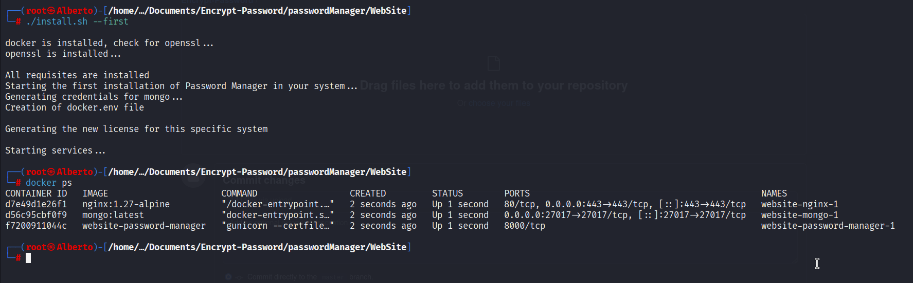

# Password Manager | Alberto Lorenzini

## Web Application
### PACKAGES LIST:
- python >= 3.10
- pymongo == 4.12 ---> driver for mongodb for python
- pip ---> package installer of pyhton
- Flask ---> Framework for python
- gunicorn == 22.0.0 ---> WSGI Server
- cryptography == 39.0.1 ---> library for symmetric encryption
- flask_jwt_extended ---> library for jwt codes management and csrf prevention
- openssl ---> tool for generating certificates
- docker [[docker guide](https://docs.docker.com/engine/install/ "Guide to install Docker Engine in multiple Linux OS")]

        The installation of this packages are shown below:
        ```
        sudo apt install python-3.10 openssl pip
        ```
        ```
        sudo pip install Flask flask_jwt_extended pymongo==4.12 gunicorn==22.0.0 cryptography==39.0.1
        ```
---
### INSTALLATION:
The are two ways to install software:

**In both ways docker must be installed in your system with this help guide: [docker guide](https://docs.docker.com/engine/install/ "Guide to install Docker Engine in multiple Linux OS")**
1. ### Docker file: (SSL / TLS)
      - Download teh project
      - Change file /etc/hosts to reach server by name: ` vim /etc/hosts ` and add **local-ip** following with **dns-name**
      - Move to directory where there's compose.yaml (default path: Encrypt-Password/passwordManager/WebSite)
      - If there are not present .nginx and .certs directories, create them with:
        ```
        mkdir .nginx .nginx/.certs
        ```
      - Remain in WebSite folder run the openssl command to generate certificate and this command install certificate in the system path.
              This command is customizable and it can be modified changing organization (O) and common name (CN).

              **TIP**: if you change Common Name (CN) you must modify the name in `/etc/hosts`
        ```
        openssl req -x509 -newkey rsa:4096 -keyout $PATH_PRODUCT_CERTS/rootCA.key -out $PATH_PRODUCT_CERTS/pw-managerRootCA.crt -sha256 -days 365 -nodes \
        -subj "/CN=jalbopass.com/C=ST/ST=Some-State/L=Some-City/O=Jalbo Industries S.p.A/OU=Jalbo PW-Manager Root CA" > /dev/null 2>&1 
        ```
      - Start compose.yaml file with the command:
        ```
        docker compose up -d 
        ```
      - Access to your browser and search  and goes to website that has been set in /etc/hosts
      - Have fun

2. ### Installation script:
      - Download the project
      - Inside the "WebSite" folder there is a script named ` install.sh `
      - Execute the script via **` sudo `** or from **root** user:
        ```
        sudo ./install.sh --install
        ```
      - `./install.sh --install` installs and provides a self-signed certificate for the website
      - Execute ` docker ps ` to ensure that all services are up and are to be shown in this way:
      
      - The website has [https://jalbopass.com](https://jalbopass.com) as default dns name and all requests are forwaded to this name
      - Change file /etc/hosts to reach server by your prefered name: ` vim /etc/hosts ` and add **local-ip** following with **dns-name** below IPv4 settings
      - Have fun

      The script set for the log files the timezone set in /etc/timezone. If you want customize
      time zone you can specify with the `--tz` or `--time-zone` parameter during launch of the script. 

3. ### Source code:
    - Download the project
    - Inside the "WebSite" folder run the following command:
      ```
      python3 -m venv .venv
      ```
    - Now you can activate the virtual environment:
      ```
      . ./.venv/bin/activate
      ```
    - You have to install dependencies and you can install in a single command:
      ```
      sudo pip install Flask flask_jwt_extended pymongo==4.12 gunicorn==22.0.0 cryptography==39.0.1 
      ```
    - Remain in WebSite folder run the openssl command to generate certificate and this command install certificate in the system path.
            This command is customizable and it can be modified changing organization (O) and common name (CN).

            **TIP**: if you change Common Name (CN) you must modify the name in `/etc/hosts`
      ```
      openssl req -x509 -newkey rsa:4096 -keyout $PATH_PRODUCT_CERTS/rootCA.key -out $PATH_PRODUCT_CERTS/pw-managerRootCA.crt -sha256 -days 365 -nodes \
      -subj "/CN=jalbopass.com/C=ST/ST=Some-State/L=Some-City/O=Jalbo Industries S.p.A/OU=Jalbo PW-Manager Root CA" > /dev/null 2>&1 
      ```
    - Finally you can run your application:
      ```
      gunicorn --certfile=.nginx/.certs/pw-managerRootCA.crt --keyfile=.nginx/.certs/rootCA.key -b 0.0.0.0:8000 app:app